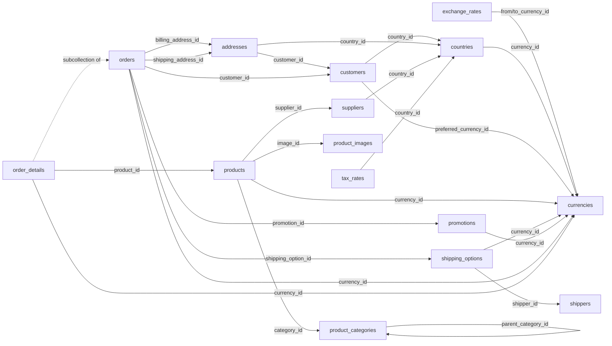

# 🛒 CRM Orders

> **Note**: This schema describes and relies on features of **inGitDB** that may not be fully implemented
> yet. Its primary purpose is to drive development of inGitDB by serving as a comprehensive real-world use
> case and to demonstrate its capabilities for business-critical applications.

CRM Orders is an open-source **inGitDB** schema template for a complete company CRM, ordering, and
shipping system. It models everything from ISO currency definitions and customer accounts through product
catalogues, supplier management, shipping carriers, and multi-line orders — including tax rates and
promotional discounts.

Because every record is a plain YAML/JSON file committed to Git, the full transaction history is an
immutable audit log with zero extra infrastructure. Any developer, auditor, or AI agent can inspect,
query, and amend data with a text editor or `git blame`.

This demo showcases inGitDB's support for **foreign-key relationships**, **subcollections**, **enum
constraints**, **regex patterns**, cross-collection **referential integrity**, and **human-readable
records**.

## ⚙️ GitHub Actions Workflow

A [GitHub Actions workflow](.github/workflows/ingitdb.yml) runs automatically on every push and pull request to `main`. It uses the [ingitdb-action](https://github.com/ingitdb/ingitdb-action) to:

1. **Validate** — checks all collection schema definitions and verifies every record conforms to its collection's constraints (types, required fields, foreign keys, enums, regex patterns).
2. **Materialize** — builds any defined views, resolving cross-collection references and producing materialized output.

## 📋 Collections Overview

| Collection | Description |
|------------|-------------|
| [currencies](collections/currencies/) | ISO 4217 currency definitions |
| [exchange_rates](collections/exchange_rates/) | Point-in-time currency exchange rates |
| [countries](collections/countries/) | ISO 3166-1 country codes and metadata |
| [customers](collections/customers/) | Customer accounts — the CRM core |
| [addresses](collections/addresses/) | Reusable billing and shipping addresses per customer |
| [product_categories](collections/product_categories/) | Hierarchical product taxonomy |
| [product_images](collections/product_images/) | Shareable product images |
| [products](collections/products/) | Product catalogue with pricing and inventory |
| [suppliers](collections/suppliers/) | Product suppliers and vendor contacts |
| [shippers](collections/shippers/) | Shipping carrier definitions |
| [shipping_options](collections/shipping_options/) | Service levels offered by each carrier |
| [tax_rates](collections/tax_rates/) | Tax rates by country and optional region |
| [promotions](collections/promotions/) | Discount codes and coupon campaigns |
| [orders](collections/orders/) | Customer order records |
| [order_details](#order_details) | Line items — subcollection of orders |

## 🗺️ Data Model

---

For full details on each collection — columns, constraints, examples, and relationships — see [collections/](collections/).
